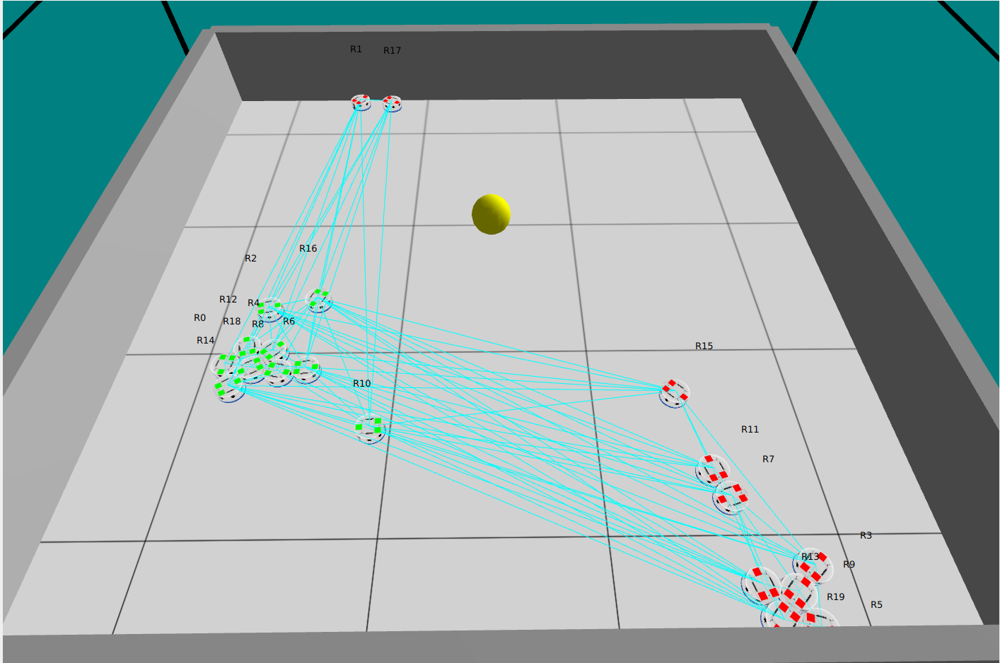
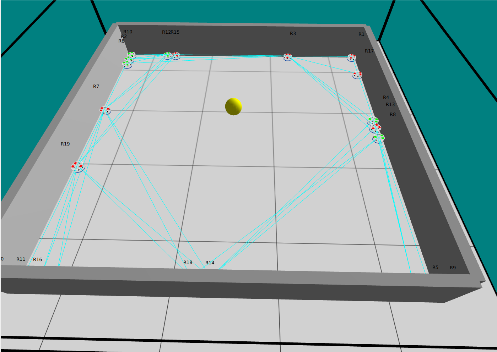

# Status Report: Group 3

We have finished the novelty search aspect of our project. 
Currently, we have done the following:

1. Written an argos / buzz simulation similar to the Brown et. al. paper

    In this simulation, we pass in 4 parameters for the neural network weights. 
    Each robot moves according to an internal neural network. 
    The input to the neural network is either `[1, 0]`, which indicates that the robot sees a robot of the *same* type, and the input of `[0, 1]` indicates that the robot sees no robot, or a robot of a different type. 
    Weights 1 and 2 are used to control the left and right wheel speeds of a bot in the case that it sees a robot of the *same* kin. 
    Weights 2 and 4 are used to control the left and right wheels in the case that the bot sees a different or no robot at all.

2. Changed the weights from 6 to 4

    This differs slightly from our proposed design - initially, we expected to use 3 inputs and 6 weights to control our bots. 
    But, we found that we ran into too much exponential complexity when running this novelty serach for this to be feasible. 
    If we used 6 weights to control each robot, then at each generation, if we select the most fit robot to permutate, then we would have to creat the following combinations:
    Each weight can either increase, decrease, or stay the same (3 possibilities). 
    We can do that for each of the 6 weights, so from a single robot, there are $3^6$ possible combinations, or 729 mutations (728 if we ignore the one where all the weights stay the same). 
    This is infeasible four us to test - each simulation + parsing took roughly 30 seconds, so each step would take roughly 6 hours for us to step from a *single* permutation of a set of weights. 

    To reduce complexity, we instead decided to use 4 weights.
    We hypothesize that to perform segregation, the bots would turn away from bots of the other kind, and thus they would only see the bots of the other kind for a short period of time. 
    This means that the weights controlling what the bots should do when it sees a bot of the other kind would not often be used, so we roll them into the "see nothing" weights, then we shouldn't see a large difference. 
    Thus, we reduce the number of permutations per weight permutation from $3^6$ to $3^4$, or just 81. 
    This lets us run a generation in a little under an hour if we select 1 weight vector to permutate per generation, and thus we could run 100 generations (similar to the Brown et. al.) paper in just 100 hours. 

3. Created a python program to run the novelty search and evaluate novelty

    We added loop functions to the argos simulation to record the location of each bot at each time step, and write this to a csv. 
    After each generation, our program reads this csv and calculates the metrics (mean distance ,radial variance, group rotation, angular momentum, scatter and average speed, identical to the Brown et. al.) for that set of weights. 
    We also calculate the standard deviation of the inter and intra group distance for each bot to use for segregation evaluation, which we will discuss below. 

4. Create a metric of segregation.

    We use a very simple metric of segregation: the ratio of the standard deviation of the distance to the mediod of each group over the total standard deviation to the mediod of the total population. 
    The thinking is as follows: if the bots are not segregated by type, then their position should *not* be dependent on their type.
    Thus if we take the mediod of each group and calculate the standard deviation of the bots to that mediod, it should be roughly identical to the standard deviation of distances to the global mediod (without calculating by group). 
    And, if the bots *are* highly segregated, then the intra-group standard deviation should be quite low (the bots of the same type are clustered together) and the inter-group standard deviation of distance to the mediod should be high as the two types should be far away from eachother, and the global mediod should be far from both groups.

    To summarize, we use this formula, taking the inverse so we are maximizing this heuristic (highly segregated have higher values):

    $$
    (\frac{group1\_dev + group2\_dev}{2 * total\_dev})^{-1}
    $$

5. Results

    The highest segregation is when the weights are `[0.61, 0.59, 0.01, 0.3]`.
    The image summarizing this result is shown below, with a segregation score of 1.49:

    

    We confirm that non-segregated populations do have a lower score by using the weights `[.3, .3, .3, .3]`, which should results in bots being far from eachother and not grouped by cluster. 
    This achieved a segregation score of .95, which is as predicted lower than the most segregated population. 

    

    More comprehensive reuslts will be shown in the final paper.
